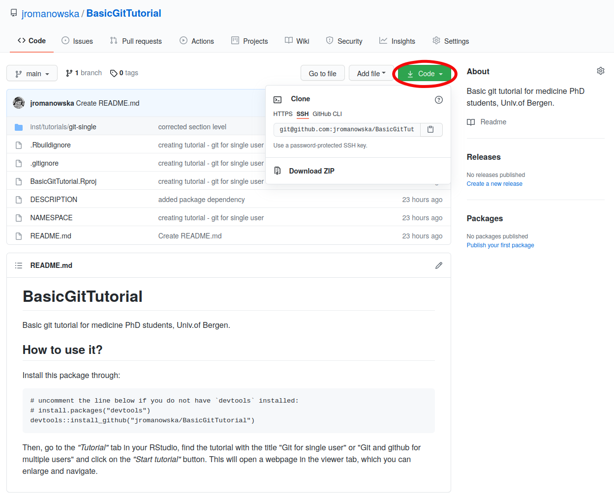
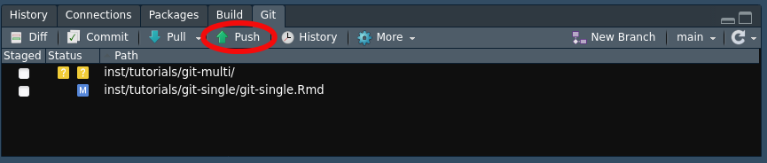
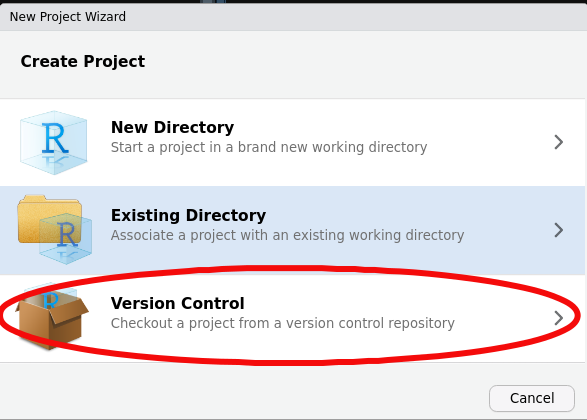
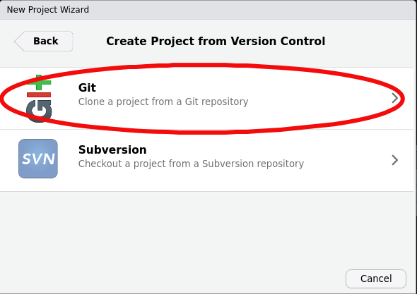
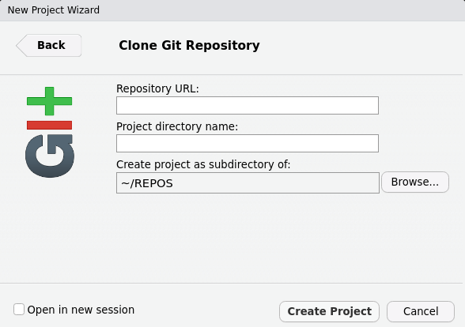
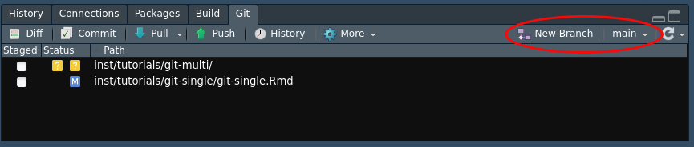
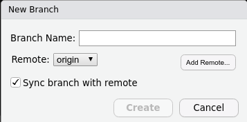
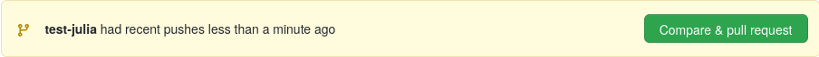
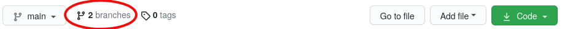
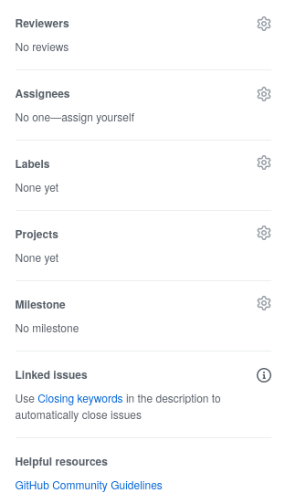

```{r setup, include=FALSE}
library(fontawesome)
library(learnr)
knitr::opts_chunk$set(echo = FALSE)
```

## Prerequisites

This tutorial is best exercised in a group of minimum two persons.

To complete this tutorial, you will need:

- R & RStudio installed
- git installed
- create a project inside RStudio with `git` version control enabled
_(you can use the project created in `Git for single user` tutorial)_
- a GitHub account
- create an empty repository under GitHub account of one of the persons in the group

> **NB:** make sure the new repo is public!

## Resolving merge conflicts

The new repository on GitHub is empty. To work with it, we will do two things:

1. the **repository owner** needs to connect their local repo (e.g., the
one created for the previous tutorial) with the remote repo on GitHub

    - the instructions are visible in the webpage of the new, empty repo
    - in brief: open a console (command line tool) by navigating to `Terminal` tab in RStudio
    - then, put the following command there and hit enter    
    `git remote add origin git@github.com:<username>/<repo_name>`
    - **NB:** you can get the address from the green 'Code' button on the main
    webpage of your repo
    


- the last action is to copy the local git history to the remote by
running push changes



- make sure that the remote repo on GitHub contains all the files 
the owner has locally
    
2. the **repo owner** needs to give the other group members access to
change this repo

    - go to "Settings" and "Manage access" on GitHub page of the repo

3. **other members of the group** need to clone this repo

    - in RStudio, choose "New Project" under "File" menu
    - in the pop-up window choose "Version control"



- next, choose "Git"
    


- and in the last step, under "Repository URL", enter the address of the
repo in the format `git@github.com:<username>/<repo_name>`



- you can select the folder where to clone the repo by clicking the
"Browse" button
- finally, click "Create project"


> Check that each member of the group has the same files now!

---

### Quiz

```{r quiz}
quiz(
  question("What is the difference between 'clone' and 'fork'?",
    answer("'fork' and 'clone' do the same thing when working on a public repo"),
    answer("'clone' creates a local copy connected to the remote, 'fork' creates a new repo, branching from the remote", correct = TRUE),
    answer("'fork' creates a local copy connected to the remote, 'clone' creates a new repo, branching from the remote")
  ),
  question("When should you fork a repo instead of cloning it?",
    answer("you can decide for youself, since it's the same thing"),
    answer("you should fork when the repo owner(s) did not give you right to change anything in the repo", correct = TRUE),
    answer("when you're hungry")
  )
)
```

---

### Exercise 1

Choose one file to focus on. Each member of the group makes some changes in this
chosen file, in the same fragment of code/text. Save changes, commit, and push.

> `r fa("lightbulb")` Each group member does it in their own pace!

> `r fa("exclamation-triangle")` Only the first `push` action will be frictionless!
> Read the information returned in the output window and act accordingly.


## Dealing with pull requests

Each group member will create a branch, make some changes and additions to the
files, and create a **pull request** to merge their own branch into the _main_ one.

### Exercise 2

In the `Git` tab, in RStudio, click on "New Branch" and name it as you wish.
You can use one of the following templates:

- `<your_name>-test`
- `new-func-<your_name>`





> `r fa("lightbulb")` Check that the name of the branch has now changed from
> `main` to the new one that you've created.

---

### Exercise 3

1. Add one or several files to the repo _(any text file or small image)_ and 
change some text within one of the original files.

2. Stage the changes and create a commit.

> `r fa("lightbulb")` Check that your new branch differs from the main one by
> alternating between the two branches in the `Git` tab.


3. Switch to your new branch and push your changes to the remote URL.


4. Wait for everyone to complete these steps and check online that the branches
are there.

---

### Exercise 4

Now, you're ready to create your first pull request!

In the GitHub repository, you should see a similar message:



Click on the green button. 

> `r fa("lightbulb")` You can also click on the information showing the number
> of branches in your repository and then choose the branch you want to create
> a pull request for.
>
> 

Now, the new branch has been compared with the `main` branch. If there are no
conflicts, you should see a green tickmark and a message saying that these
branches can be merged automatically. Otherwise, you will be asked to resolve
a merge conflict, as we did above.

You can check what differences were detected below the comment section. 

Fill in the details (title and comment) to create your pull request and click
the green button.

> `r fa("lightbulb")` On the right-hand side, there are several useful
> parameters:
>
> - _"Reviewers"_ - you can add a reviewer of your changes; very useful if
>   you want to avoid stupid mistakes! The reviewer will be notified and can
>   comment and accept your changes or request amendments.
> - _"Assignees"_ - if there are many collaborators, it might be useful to
>   dedicate the merging task to one of them.
> - _"Labels"_ - you can tag each pull request, useful for searching afterward.
> - _"Projects"_, _"Milestones"_ - you can categorize pull requests, useful in big projects.
> - _"Linked issues"_ - GitHub allows to create "Issues", so that everyone
>   who has a GitHub account can communicate with repo owners - there, one can
>   e.g., describe problems, file bugs, etc. When resolving a problem with your
>   code, it's useful to create an issue that describes the problem and then
>   match the issue number with a pull request that resolves it.
> 
> 

Next, the repository owner can accept the pull request, merge the branches, and
the branch can be deleted.

