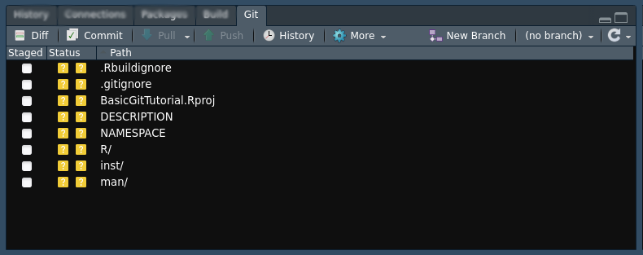

```{r setup, include=FALSE}
library(learnr)
library(fontawesome)
knitr::opts_chunk$set(echo = FALSE)
```


## Prerequisites

To complete this tutorial, you will need:

- R & RStudio installed
- git installed
- create a project inside RStudio with `git` version control enabled

## Git in RStudio

Locate the `git` tab in your RStudio. At first, none of the files that are in the
current project are tracked, so the _status_ icon shows a question mark `?`.



### Exercise 1

Add the script or the .Rmd file you have been working on to your repository.

> `r fa("lightbulb")` HINT: to make `git` keep track of your files, you need to `stage` the changes
> and then `commit` those.

> `r fa("exclamation-triangle")` Do not `push` changes!

### Quiz 1

```{r quiz}
quiz(
  question("What is the difference between 'commit' and 'push'?",
    answer("'push' saves the current changes, 'commit' sends them to the remote server"),
    answer("'push' blocks the current file from further changes, while 'commit' does not"),
    answer("'commit' saves the current changes, 'push' sends them to the remote server", correct = TRUE)
  ),
  question("When should you commit the changes?",
    answer("whenever you're finished with your current task", correct = TRUE),
    answer("whenever you change a line"),
    answer("only when the others get angry at you for not commiting")
  )
)
```


## History of changes

Now that your initial version is saved in git, we will learn how to navigate
the history of changes.

### Exercise 2

Make some changes to your file - you can, e.g., write some more code or add
comments.

Notice that the icon beside the modified file changed.


## Topic 1

### Exercise 

*Here's a simple exercise with an empty code chunk provided for entering the answer.*

Write the R code required to add two plus two:

```{r two-plus-two, exercise=TRUE}

```

### Exercise with Code

*Here's an exercise with some prepopulated code as well as `exercise.lines = 5` to provide a bit more initial room to work.*

Now write a function that adds any two numbers and then call it:

```{r add-function, exercise=TRUE, exercise.lines = 5}
add <- function() {
  
}
```

## Topic 2

### Exercise with Hint

*Here's an exercise where the chunk is pre-evaulated via the `exercise.eval` option (so the user can see the default output we'd like them to customize). We also add a "hint" to the correct solution via the chunk immediate below labeled `print-limit-hint`.*

Modify the following code to limit the number of rows printed to 5:

```{r print-limit, exercise=TRUE, exercise.eval=TRUE}
mtcars
```

```{r print-limit-hint}
head(mtcars)
```

### Quiz

*You can include any number of single or multiple choice questions as a quiz. Use the `question` function to define a question and the `quiz` function for grouping multiple questions together.*

Some questions to verify that you understand the purposes of various base and recommended R packages:

```{r quiz}
quiz(
  question("Which package contains functions for installing other R packages?",
    answer("base"),
    answer("tools"),
    answer("utils", correct = TRUE),
    answer("codetools")
  ),
  question("Which of the R packages listed below are used to create plots?",
    answer("lattice", correct = TRUE),
    answer("tools"),
    answer("stats"),
    answer("grid", correct = TRUE)
  )
)
```
