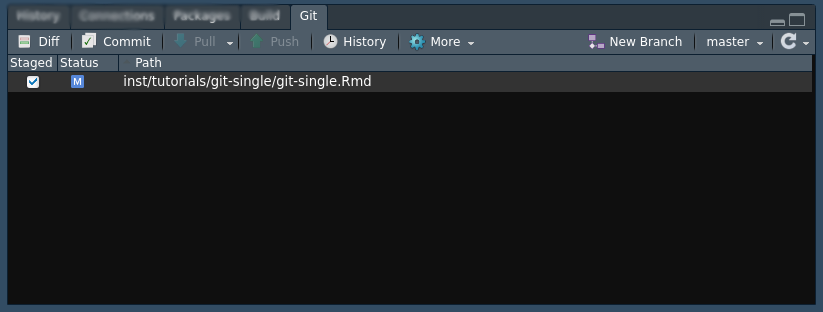
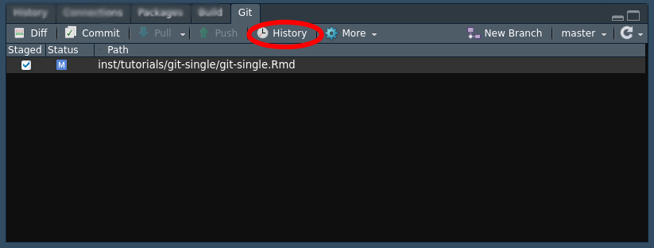
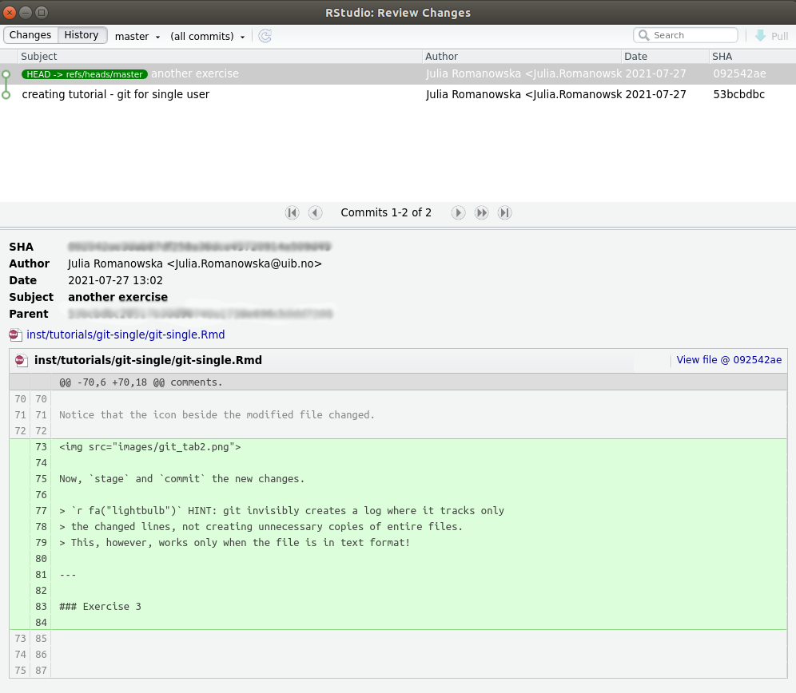
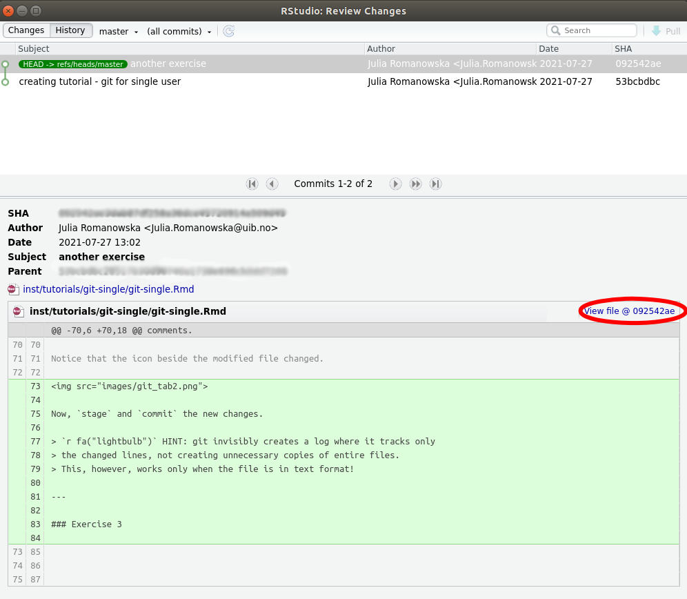

```{r setup, include=FALSE}
library(learnr)
library(fontawesome)
knitr::opts_chunk$set(echo = FALSE)
```


## Prerequisites

To complete this tutorial, you will need:

- R & RStudio installed
- git installed
- create a project inside RStudio with `git` version control enabled

## Git in RStudio

Locate the `git` tab in your RStudio. At first, none of the files that are in the
current project are tracked, so the _status_ icon shows a question mark `?`.


### Exercise 1

Add the script or the .Rmd file you have been working on to your repository.

> `r fa("lightbulb")` HINT: to make `git` keep track of your files, you need to `stage` the changes
> and then `commit` those.

> `r fa("exclamation-triangle")` Do not `push` changes!

### Quiz 1

```{r quiz}
quiz(
  question("What is the difference between 'commit' and 'push'?",
    answer("'push' saves the current changes, 'commit' sends them to the remote server"),
    answer("'push' blocks the current file from further changes, while 'commit' does not"),
    answer("'commit' saves the current changes, 'push' sends them to the remote server", correct = TRUE)
  ),
  question("When should you commit the changes?",
    answer("whenever you're finished with your current task", correct = TRUE),
    answer("whenever you change a line"),
    answer("only when the others get angry at you for not commiting")
  )
)
```


## History of changes

Now that your initial version is saved in git, we will learn how to navigate
the history of changes.

### Exercise 2

Make some changes to your file - you can, e.g., write some more code or add
comments.

Notice that the icon beside the modified file changed.



Now, `stage` and `commit` the new changes.

> `r fa("lightbulb")` HINT: git invisibly creates a log where it tracks only
> the changed lines, not creating unnecessary copies of entire files.
> This, however, works only when the file is in text format!

---

Check that the changes are there by navigating to the `History` tab.



You will see the log of all the changes in the top part of the window
and details of the selected commit in the bottom part of the window.




### Exercise 3

Now, delete a random piece of code or text and `commit` the change.

---

## Time travelling with git

**OH NO! I want it back!**

_It's not a problem with `git`!_

### Exercise 4

When the changes are commited, select the `History` view, navigate to the commit
that includes the code version you want, and click on `View file @ <SHA-id>`.



Next, simply copy the code into your current file or save the previous version
of the file.

> **NOTE:** there is also a `revert` option for each file, which reverts all the
changes made after the last commit.

