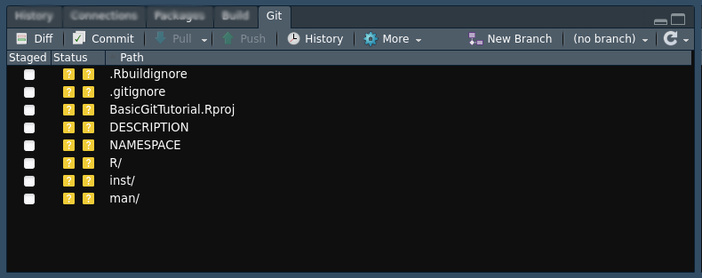
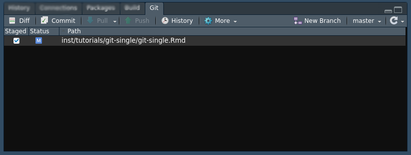
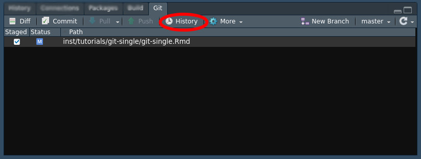
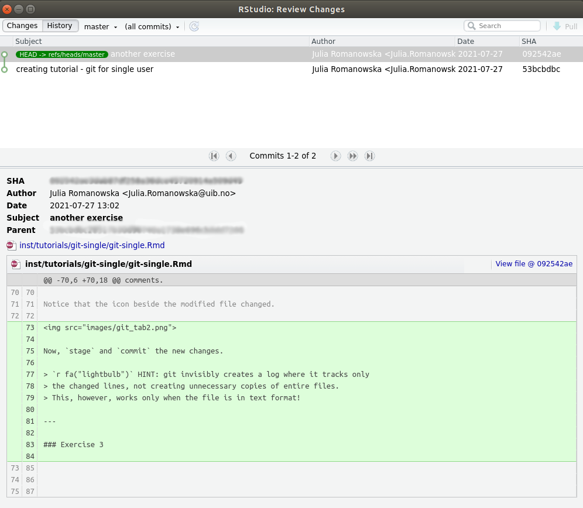
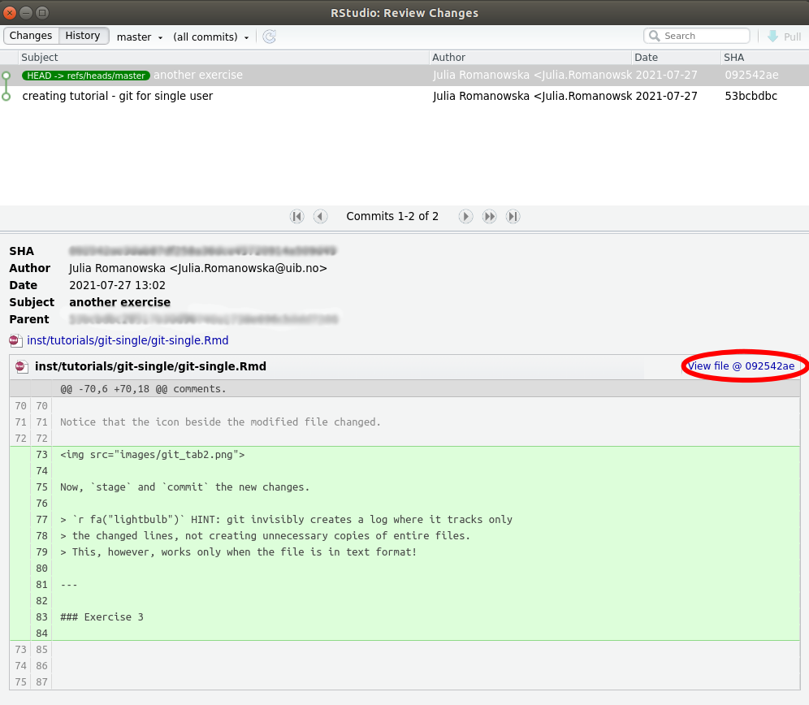
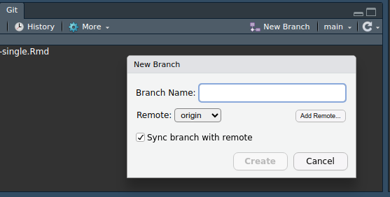
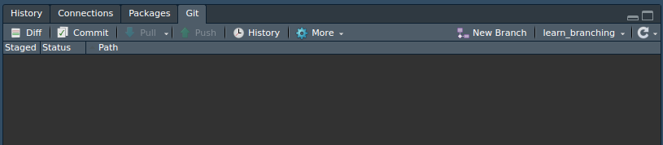

```{r setup, include=FALSE}
library(learnr)
library(fontawesome)
knitr::opts_chunk$set(echo = FALSE)
```


## Prerequisites

To complete this tutorial, you will need:

- R & RStudio installed
- git installed
- create a project inside RStudio with `git` version control enabled

## `r fa("git")` Git in RStudio

Locate the `git` tab in your RStudio. At first, none of the files that are in the
current project are tracked, so the _status_ icon shows a question mark `?`.



### Exercise 1

Add the script or the .Rmd file you have been working on to your repository.

> `r fa("lightbulb")` HINT: to make `git` keep track of your files, you need to `stage` the changes
> and then `commit` those.

> `r fa("triangle-exclamation")` Do not `push` changes!

### Quiz 1

```{r quiz}
quiz(
  question("What is the difference between 'commit' and 'push'?",
    answer("'push' saves the current changes, 'commit' sends them to the remote server"),
    answer("'push' blocks the current file from further changes, while 'commit' does not"),
    answer("'commit' saves the current changes, 'push' sends them to the remote server", correct = TRUE)
  ),
  question("When should you commit the changes?",
    answer("whenever you're finished with your current task", correct = TRUE),
    answer("whenever you change a line"),
    answer("only when the others get angry at you for not commiting")
  )
)
```


## `r fa("clock-rotate-left")` History of changes

Now that your initial version is saved in git, we will learn how to navigate
the history of changes.

### Exercise 2

Make some changes to your file - you can, e.g., write some more code or add
comments.

Notice that the icon beside the modified file changed.



Now, `stage` and `commit` the new changes.

> `r fa("lightbulb")` HINT: git invisibly creates a log where it tracks
> the changed lines. This, however, works only when the file is in text format!

---

Check that the changes are there by navigating to the `History` tab.



You will see the log of all the changes in the top part of the window
and details of the selected commit in the bottom part of the window.




### Exercise 3

Now, delete a random piece of code or text and `commit` the change.

---

## `r fa("rotate-left")` Time travelling with git

**OH NO! I want it back!**

_It's not a problem with `git`!_

### Exercise 4

When the changes are commited, select the `History` view, navigate to the commit
that includes the code version you want, and click on `View file @ <SHA-id>`.



Next, simply copy the code into your current file or save the previous version
of the file.

> **NOTE:** there is also a `revert` option for each file, which reverts all the
changes made after the last commit.

---

## `r fa("code-branch")` Branching

Branching creates parallel histories of code development. It's useful e.g., if you
need to test an idea that you're not sure of, or if you're working with someone
else and you don't want to interrupt one another while coding different things.

Here, you'll learn how to create branches while working alone.

### Exercise 5

Create a branch by clicking on "New Branch" button in git tab and give it a name.



> `r fa("lightbulb")` HINT: branches are created for a specific _task_, so they
> need to be named as such. Do not create branch names such as "Alice" or 
> "my_branch1" since these will not make meaning.

You should see a similar information:

```
>>> /usr/bin/git checkout -B learn_branching
Switched to a new branch 'learn_branching'
```

Close the pop-up window and check that you are now in a new branch.



> **NOTE:** Everything should look exactly the same because we have not
> made any changes yet.

### Exercise 6

Open the history and inspect. There should be two labels by the latest
commit: one called "main" and the other with text containing your new branch.

```
HEAD -> refs/heads/learn_branching
```

> **NOTE:** This simply tells git that your branch is at the same point as the
> version of the repository in 'main'.

Make some changes to a file or add a new file and commit the changes.

Inspect the history again - _what has changed?_

---

## `r fa("frog")` Branch hopping

Now that you have two versions of the code, you can easily switch between them.

### Exercise 7

To change the active branch, simply choose it from the dropdown menu on the
right top corner of the Git tab.

Examine the changes in the code and how History looks like when switching
branches.

### Exercise 8

Go to the main branch, add a file and commit. Next, create a new branch and make
changes in the new file.

Inspect the history again. Switch branches and look how the scripts change.

> **NOTE:** each time you commit, make sure you know which branch are you on!

---

##  `r fa("code-merge")` Merging

After we're done with the coding task in our branch, we need to choose what
will happen with it:

1. **If we want to keep the changes created in the branch** - merge this
branch with 'main' _and delete the branch_.
1. **If we're not satisfied with the changes** - delete this branch without
merging.

> **NOTE:** Branches should be _short-lived_ so it's important to keep their
> number in the repo at minimum.

### Exercise 7

RStudio GUI doesn't allow for merging or deleting branches, so we'll dive into
the terminal!

> `r fa("lightbulb")` HINT: you'll find the terminal tab beside the 'Console'.

> `r fa("lightbulb")` HINT: by default, terminal shows you different things, 
> depending on your OS:
>
> - on Mac and Linux, you'll see the username, hostname (name of your computer),
> current directory, and the symbol `$`.
> - on Windows, you'll probably see only the current directory path and `>`.
>
> After a command is executed, you should be able to see that same line again.
> If nothing displays, the command is probably still executing.

Run the command:

```sh
git branch
```

_You should be able to see the names of the branches, where one of them has an
asterisk (`*`) to mark it as the active branch._ To merge or delete a branch,
we need to be on 'main' branch, so first, switch to that one.

To merge a branch, run the command:

```sh
git merge <branch-to-be-merged>
```

(put the name of your branch instead of `<branch-to-be-merged>`). You should see
a summary of the changes made, e.g.:

```
Merge made by the 'ort' strategy.
 scripts/script1.R | 6 ------
 1 file changed, 6 deletions(-)
```

Inspect the code - _how did it change?_

Check which branches are available again (`git branch`) - the branch was
merged successfully, meaning that now the 'main' (active) branch includes all
the changes we had on the other branch, but the other branch is still there.
We need to delete the merged branch:

```sh
git branch -d <branch-to-be-deleted>
```

Check which branches are available again and inspect the History.

### Quiz 2

```{r quiz_branch}
quiz(
  question("How many branches should you keep in the repository?",
    answer("as many as the files"),
    answer("as few as possible", correct = TRUE),
    answer("always 3: main, bugs, release")
  ),
  question("Which names are best suited for naming branches?",
    answer("'test_model_with_adjustments', 'check_B_normalization',
           'version_for_A_journal'", correct = TRUE),
    answer("'2024-03-05', '2024-05-06'"),
    answer("'JaneDoe', 'AngryCowboy'")
  )
)
```

---

## Summary

Now, you should know how to:

- enable `r fa("git")` in your RStudio projects
- commit changes and inspect the history
- revert changes `r fa("rotate-left")`
- create parallel versions of history with branching `r fa("code-branch")`
- switch `r fa("frog")` between branches, `r fa("code-merge")` merge, and `r fa("trash")` delete them

> `r fa("medal")` Congratulations! You're ready to learn how to use
> `r fa("git")` and `r fa("github")` in collaboration!
